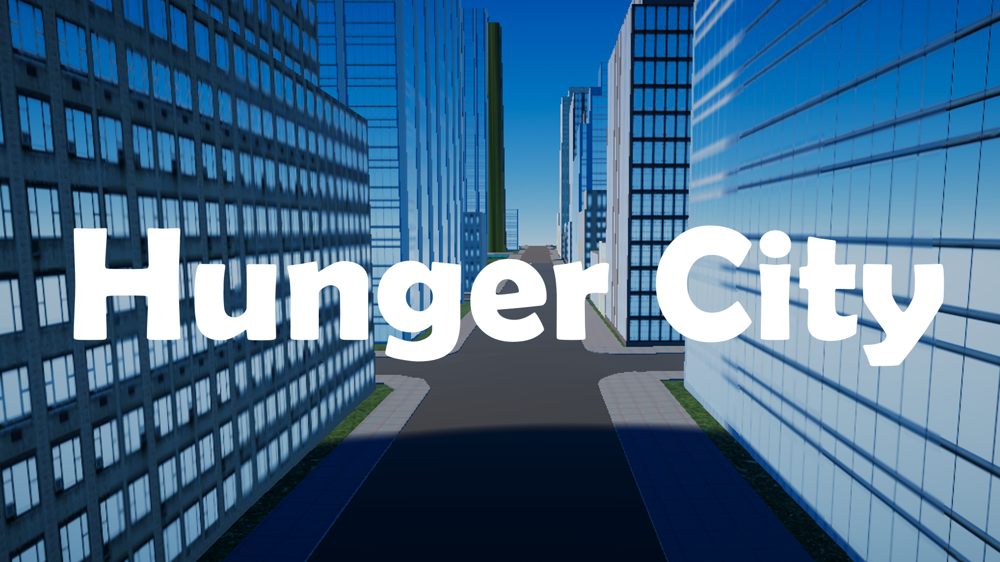

# Hunger City

> Survive in the city after losing your house and no food as you meet retaliation from every corner

This game is a first-person game where the player must gather food to survive in a hostile world where any attempt to gain food will result in being chased by enemies.

(Some assets not used in this game may still be in the project as the project is based on a previous FPS demo)

## Assets used
- Skybox uses [AllSky Free - 10 Sky / Skybox Set](https://assetstore.unity.com/packages/2d/textures-materials/sky/allsky-free-10-sky-skybox-set-146014)
- City scene uses [Real New York City Vol. 1](https://assetstore.unity.com/packages/3d/environments/urban/real-new-york-city-vol-1-208247)
- Particles from [Explosive Realistic VFX Texture Free](https://assetstore.unity.com/packages/vfx/particles/fire-explosions/explosive-realistic-vfx-texture-free-34541)
- Library used for showing tag selection in Unity Editor [Unity Tag Selector](https://github.com/WSWhitehouse/Unity-Tag-Selector)
- Asset for food item in game [PBR Pizza](https://assetstore.unity.com/packages/3d/props/food/pbr-pizza-108425)
### Textures used
- New road texture [Road 007](https://ambientcg.com/view?id=Road007)

## Game systems
- Dialogue system
- Pause menu
- UI
    - UI for displaying the hunger and health of the player
- Player locomotion
    - Jumping
    - Movement
- Camera controls
- Weapon fire
- Enemy AI
    - Enemy base script
    - Enemy guard only attacking when food is stolen
- World spawn manager (for enemies paired with a food item to protect)
- Hunger system
- Health system
- Pickables
    - Reset Hunger to zero
    - Heal health
